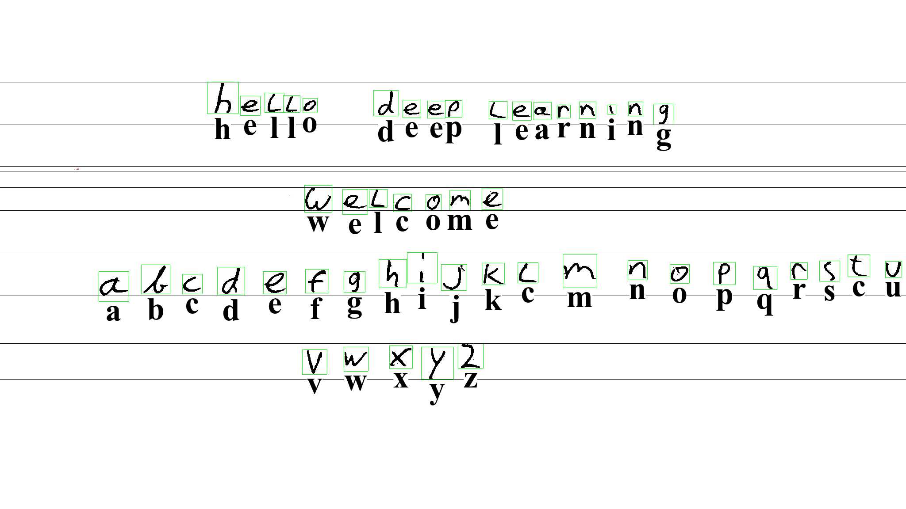

# hello-dl
A from scratch introduction to modern machine learning. Many tutorials exist
already of course, but this one aims to really explain what is going on.
Other documents start out from the (very impressive) PyTorch environment, or
they attempt to math it up from first principles. 



Trying to understand deep learning via PyTorch is like trying to learn
aerodynamics from flying an Airbus A380. 

Meanwhile the pure maths approach ("see it is easy, it is just a Jacobian
matrix") is probably only suited to people who dream in derivatives.

The goal of this tutorial is to develop modern neural networks entirely from
scratch, but where we still end up with really impressive results.

To do so, this project contains some minimalist tooling.  The software may
be minimal, but will showcase modern deep learning techniques that should
wow you into believing that something very special is going on.

The intended audience is people comfortable with programming and who want to
(re)join the artificial intelligence scene from the ground up.

This project was inspired by [Georgi Gerganov](https://ggerganov.com/)'s
AWESOME [C++ implementation of OpenAI's Whisper speech/translation model](https://github.com/ggerganov/whisper.cpp).

# Mission statement

 * Really make you feel what deep learning is all about
   * Tools must do things you will be personally be impressed by
 * Not skimp over the details, how does it ACTUALLY work
 * Make reading the tool's source code a good learning experience
   * More important that code is readable than that it is as fast as possible
   * Also be fast enough that it is "doable" though
 * Cover all the techniques that form the backbone of modern DL successes
 * Use language and terms that are compatible with modern day usage
   * So you can also understand PyTorch tutorials
   * However, also not confuse you with weird historical words
 * Provide modules that mirror popular functionality in PyTorch

Non-goals:

 * Turn you into a machine learning professional
 * Teach you PyTorch directly

The idea is that after you are done with the blog posts (yet to be written) and
have worked with the tools that it should all make sense to you. And *then*
you can get to work with professional tooling and get to work.

Although this is an introduction using minimal dependencies and lines of
code, we'll be covering advanced subjects like momentum, data augmentation,
weight decay, batch normalization, dropout and GELU.

And unlike most demos, this one includes crowd sourced validation data that
helps show why many deep learning projects are great in theory but
disappoint in practice.

# Acknowledgments 
Despite doing some neural network experiments in the 1990s, I'm extremely new to the modern stuff. The following projects/sites have been very useful in catching up:

 * NIST and Gregory Cohen, Saeed Afshar, Jonathan Tapson, and Andre van Schaik
   from The MARCS Institute for Brain, Behaviour and Development for creating and maintaining the MNIST [database of handwritten characters](https://arxiv.org/abs/1702.05373).
 * The PyTorch project, their documentation and samples are invaluable
 * Facebook's [Flashlight](https://github.com/flashlight/flashlight), a fast, flexible machine learning library written entirely in C++ from the Facebook AI Research and the creators of Torch, TensorFlow, Eigen and Deep Speech. Their source code helped me understand lots of things.
 * [Andrej Karpathy](https://twitter.com/karpathy)'s [micrograd](https://github.com/karpathy/micrograd) Python autogradient implementation is a tiny work of art
 * Andrej Karpathy's post [The Unreasonable Effectiveness of Recurrent Neural Networks](https://karpathy.github.io/2015/05/21/rnn-effectiveness/), and also [this post](https://karpathy.github.io/2019/04/25/recipe/)
 * [FastAI](https://fast.ai)'s Jupyter notebooks.
 
<!-- https://medium.com/geekculture/a-2021-guide-to-improving-cnns-optimizers-adam-vs-sgd-495848ac6008 --> 
<!-- GRU https://blog.floydhub.com/gru-with-pytorch/ -->
<!-- GRU paper https://arxiv.org/pdf/1406.1078.pdf -->
<!-- https://arxiv.org/pdf/2212.14034.pdf large language models on smaller systems -->
<!-- https://github.com/coin-or/ADOL-C - automatic differentiation -->
<!-- need to address "bagging" -->
<!-- need to address "batch normalization" -->
<!-- need to address "data augmentation" -> https://www.tensorflow.org/api_docs/python/tf/keras/preprocessing/image/ImageDataGenerator -->

# Status
So far this implements a small but pretty nice autograd system. In
`tensor-relu.cc` you can find a ~150 line total computer program that
learns to recognize handwritten digits in a few seconds (90% accuracy so far).
I'm aware it is probably overfitting the data right now.

```bash
git clone https://github.com/berthubert/hello-dl.git
cd hello-dl
cmake .
make -j4
wget http://www.itl.nist.gov/iaui/vip/cs_links/EMNIST/gzip.zip
unzip gzip.zip
./tensor-relu
```
The result is nice:

```
Start!
Have 240000 images
Configuring network................................................................
Tying... done
Getting topology.. 
(some time passes)
Percent batch correct: 32.8125%
Average loss: 2.1219. Predicted: 8, actual: 8: We got it right!
Loss: 1.89751, -2.44847 -2.54296 -2.43445 -1.92324 -3.07031 -2.50595 -2.27749 -2.1481 -1.89751 -2.26366
          .******           
         *XXXXXXXXX.        
        .XXXXX**XXXX        
        XXXX.    XXX.       
        XXX*     *XX*       
       .XXX.     .XX*       
        XXX.     *XX.       
        XXX.     XXX        
        *XXX.   XXXX        
         *XXX. .XXX*        
         .XXXXXXXXX*        
           *XXXXXXX         
            XXXXXX.         
          .XXXXXXX.         
         .XXXXXXXXX         
        .XXX*   XXX*        
        *XXX    XXX*        
        XXX*    XXX*        
        XXX.    *XX*        
        XXX*    XXX*        
        *XXX*.*XXXX*        
        *XXXXXXXXXX.        
         .XXXXXXX.          
           *****            
```

This software is meant to accompany a series of blog posts introducing deep
learning from the ground up. That series hasn't started yet as I am still
figuring out how this stuff works.

If you want to see something cool already, take a look at
[testrunner.cc](./testrunner.cc)
which already shows some of the autogradient stuff.

# Getting started
Checkout the repository, run `cmake .` and then `make`.
To actually do something [download the
EMNIST](http://www.itl.nist.gov/iaui/vip/cs_links/EMNIST/gzip.zip) dataset
and unzip it. There's no need to gunzip the .gz files.

Next up, run `./tensor` or `./first-convo` and wonder what you are seeing.

# Data
https://www.nist.gov/itl/products-and-services/emnist-dataset

https://arxiv.org/pdf/1702.05373v1
http://yann.lecun.com/exdb/mnist/

# Inspiration
https://github.com/fastai/fastbook/blob/master/04_mnist_basics.ipynb

Also really good:
https://pytorch.org/tutorials/beginner/nn_tutorial.html

# Internals
~~Use `TrackedNumber` to build networks. You can also run them there if you want, but a faster way is to export them as 'Work' objects, which are a solid slab of contiguous memory.~~
